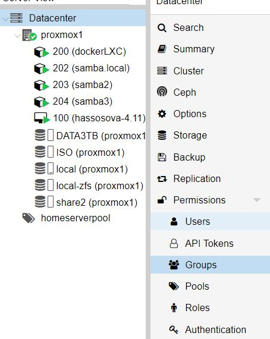

# Proxmox

## How to setup shared directory on Proxmox host to be used in multiple LXC containers (mount)

1. On Proxmox create new user group (like **homegroup**) in Datacenter
2. Create new user (like **homeuser**)

3. Create new user on node through command line