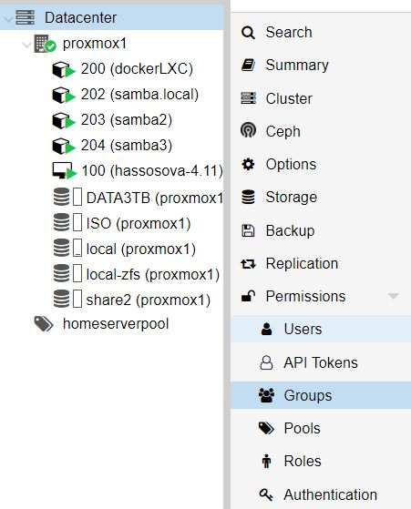

# Proxmox

## Source  links:

- [https://pve.proxmox.com/wiki/Unprivileged_LXC_containers](https://pve.proxmox.com/wiki/Unprivileged_LXC_containers)
- [https://github.com/ahuacate/proxmox-lxc-homelab#100-unprivileged-lxc-containers-and-file-permissions](https://github.com/ahuacate/proxmox-lxc-homelab#100-unprivileged-lxc-containers-and-file-permissions)

## How to setup shared directory on Proxmox host to be used in multiple LXC containers (mount)

1. On Proxmox create new user group (like **homegroup**) in Datacenter
2. Create new user (like **homeuser**)



3. Create new user on node through command line 
```
groupadd homegroup &&
useradd  -g homegroup -m homeuser
```
- to find out what ids created user has, do `id homeuser`

4. Create new `zfs pool`
- execute for example `zfs create DATA3TB/homeshare/share`
5. Give to the new created user ownership of this folder
```
chgrp -R homegroup /DATA3TB/homeshare/share
chown -R homeuser /DATA3TB/homeshare/share
```
6. Then create new lxc container with ubuntu (for example with `id: 203`).
7. Now we need to edit `203.conf`

    Location of every **conf** file is in `/etc/pve/lxc/*.conf`
    To edit `203.conf` we execute 
```
nano /etc/pve/lxc/203.conf
```
- We need to add following lines 
```
mp0: /DATA3TB/homeshare/share/,mp=/mnt/share
lxc.idmap: u 0 100000 1607
lxc.idmap: g 0 100000 1000
lxc.idmap: u 1607 1607 1
lxc.idmap: g 1000 1000 1
lxc.idmap: u 1608 101608 63928
lxc.idmap: g 1001 101001 64535
```
- First line `mp0...`defines the new share
- other lines assume that the user `homeuser` and his group `homegroup`have id´s of `user = 1607` and `group = 1000`
8. Only once per node (**proxmox server**) following files have also to be edited:
```markdown
/etc/subuid
/etc/subgid
```
- In both files we add lines:
  - in subuid `root:1607:1`
  - in subgid `root:1000:1`

9. To test if the mount and rights has worked, we test it when we login into lcs container and execute `df -h`.

    We must see our share `/mnt/share/`
10. Then we can try to create new file or folder in that location `mkdir /mnt/share/testfolder`

    If we don´t receive any error, then everything is fine.
11. In lcx container install samba for sharing with `apt update && apt install samba`
12. After that we modify samba config file
```
mv /etc/samba/smb.conf /etc/samba/smb.bak
nano /etc/samba/smb.conf
```
13. The configration looks like this 
```conf
[global]
workgroup = WORKGROUP

[data]
path = /mnt/share
writeable = yes
browseable = yes
valid user = pegasus
force user = root
```

