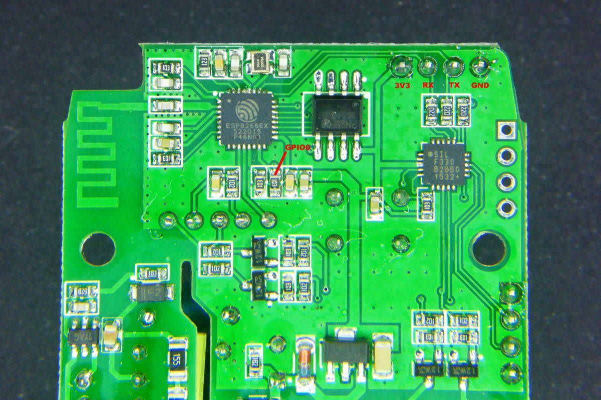

# Home assistant

This is a list of different installation steps that I have performed:

## Install Home Assistant, Samba, LetsEncrypt

[BRUH Video get started again](https://www.youtube.com/watch?v=G8XWsXlfGFQ)

[BRUH Portforwarding, DNS, Encryption](https://www.youtube.com/watch?v=BIvQ8x_iTNE)

Update procedure for All in one installation:

[Update All in One HASS](https://home-assistant.io/docs/installation/raspberry-pi-all-in-one/#upgrading)

## Arduino
This is an instruction how to install arduino IDE "portable".
https://youtu.be/jpjfVc-9IrQ?t=556

## MQTT
Very good descriptions for installing MQTT mosquitto are:

[Video BRUH](https://www.youtube.com/watch?v=AsDHEDbyLfg)

[Video good description](https://www.youtube.com/watch?v=1CGfGuZqmhc&t)

[Autostart description](http://www.switchdoc.com/2016/02/tutorial-installing-and-testing-mosquitto-mqtt-on-raspberry-pi/)

Listen to all mosquitto commands:
```
mosquitto_sub -d -t "#"
mosquitto_sub -d -u username -P password -t "#"

```
Start and stop mosquitto broker, even if autostart is enabled:
```
sudo /etc/init.d/mosquitto stop

sudo /etc/init.d/mosquitto start
```

Interesting forum topic [mosquitto  and cloudmqtt](https://community.home-assistant.io/t/mqtt-working-mosquitto-cloudmqtt-bridge/1830/5)

And also here is detail what to do for bridging mosquitto and cloudmqtt [bridge mosquitto and cloudmqtt](https://github.com/bastshoes/hass_config/blob/master/README.md)


## Install Amazon dash
For the installation I have followed the steps from BRUH.
[BRUH Dash ](http://www.bruhautomation.com/single-post/2016/11/22/How-To-Use-an-Amazon-Dash-with-IFTTT-and-Home-Assistant)

In the step **"Installing Dasher on a Raspberry Pi"** I had to install this lines of codes:
```
sudo apt-get install libpcap-dev
sudo apt-get install npm
sudo apt-get install node
wget http://node-arm.herokuapp.com/node_latest_armhf.deb
sudo dpkg -i node_latest_armhf.deb
git clone https://github.com/maddox/dasher.git
cd dasher
sudo npm install
```

If there is a need to remove autostart, then:

`sudo update-rc.d dasher remove`

## Install Sonoff dual
General information is found [here ](https://github.com/arendst/Sonoff-Tasmota) (sonoff tasmota github). But since sonoff dual need additional soldering, here is the better picture for the GPIO0 PIN.

