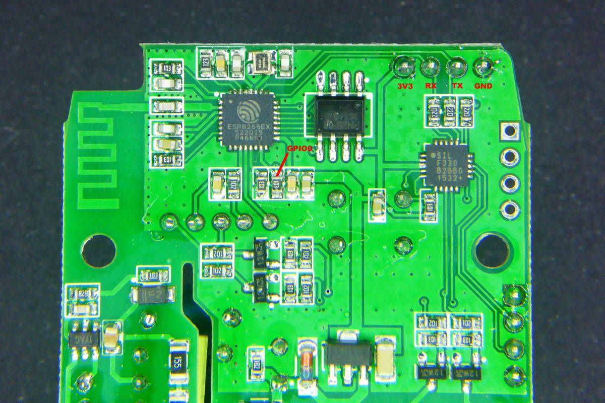

# Home assistant

This is a list of different installation steps that I have performed:

## Install Amazon dash
For the installation I have followed the steps from BRUH.
[BRUH Dash ](http://www.bruhautomation.com/single-post/2016/11/22/How-To-Use-an-Amazon-Dash-with-IFTTT-and-Home-Assistant)

In the step **"Installing Dasher on a Raspberry Pi"** I had to install this lines of codes:
```
sudo apt-get install libpcap-dev
sudo apt-get install npm
sudo apt-get install node
wget http://node-arm.herokuapp.com/node_latest_armhf.deb
sudo dpkg -i node_latest_armhf.deb
git clone https://github.com/maddox/dasher.git
cd dasher
sudo npm install
```

If there is a need to remove autostart, then:

`sudo update-rc.d dasher remove`

## Install Sonoff dual
General information is found [here ](https://github.com/arendst/Sonoff-Tasmota) (sonoff tasmota github). But since sonoff dual need additional soldering, here is the better picture for the GPIO0 PIN.

